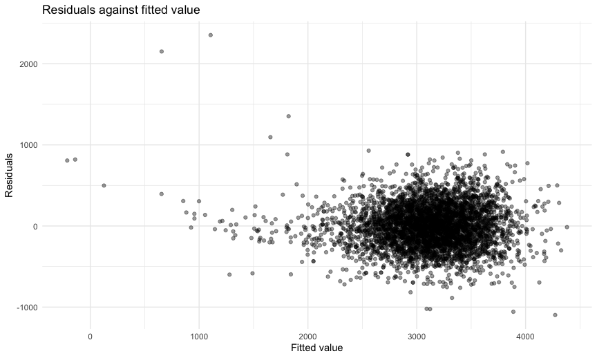
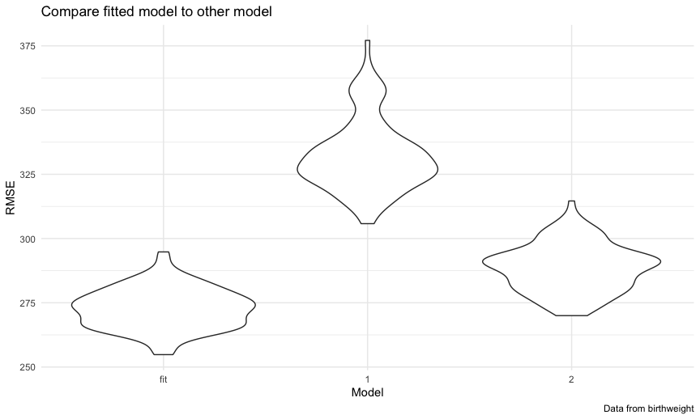

Homework 6 solutions
================
Rio Yan
2020-12-08

## Problem 1

Read in the data.

``` r
homicide_df = 
  read_csv("./data/homicide-data.csv", na = c("", "NA", "Unknown")) %>% 
  mutate(
    city_state = str_c(city, state, sep = ","),
    victim_age = as.numeric(victim_age),
    resolution = case_when(
      disposition == "Closed without arrest" ~ 0,
      disposition == "Open/No arrest" ~ 0,
      disposition == "Closed by arrest" ~ 1)
  ) %>% 
  filter(
    victim_race %in% c("White", "Black"),
    city_state != "Tulsa,AL") %>% 
  select(city_state, resolution, victim_age, victim_race, victim_sex)
```

    ## Parsed with column specification:
    ## cols(
    ##   uid = col_character(),
    ##   reported_date = col_double(),
    ##   victim_last = col_character(),
    ##   victim_first = col_character(),
    ##   victim_race = col_character(),
    ##   victim_age = col_double(),
    ##   victim_sex = col_character(),
    ##   city = col_character(),
    ##   state = col_character(),
    ##   lat = col_double(),
    ##   lon = col_double(),
    ##   disposition = col_character()
    ## )

Start with one city.

| term              |    OR | CI\_lower | CI\_upper |
| :---------------- | ----: | --------: | --------: |
| (Intercept)       | 1.363 |     0.975 |     1.907 |
| victim\_age       | 0.993 |     0.987 |     1.000 |
| victim\_raceWhite | 2.320 |     1.648 |     3.268 |
| victim\_sexMale   | 0.426 |     0.325 |     0.558 |

Try this across cities.

``` r
models_results_df =
  homicide_df %>% 
  nest(data = -city_state) %>% 
  mutate(
    models = 
      map(.x = data, ~glm(resolution ~ victim_age + victim_race + victim_sex,
    data = .x, family = binomial())),
    results = map(models, broom::tidy)
  ) %>% 
  select(city_state, results) %>% 
  unnest(results) %>% 
  mutate(
    OR = exp(estimate),
    CI_lower = exp(estimate - 1.96 * std.error),
    CI_upper = exp(estimate + 1.96 * std.error)
  ) %>% 
  select(city_state, term, OR, starts_with("CI"))
```

``` r
models_results_df %>% 
  filter(term == "victim_sexMale") %>% 
  mutate(city_state = fct_reorder(city_state, OR)) %>% 
  ggplot(aes(x = city_state, y = OR)) + 
  geom_point() + 
  geom_errorbar(aes(ymin = CI_lower, ymax = CI_upper)) + 
  theme(axis.text.x = element_text(angle = 90, hjust = 1))
```


**Comment**:

## Problem 2

Find some residuals

``` r
baby_df = 
  read_csv("./data/birthweight.csv") %>% 
  mutate(
    babysex = factor(babysex),
    frace = factor(frace),
    malform = factor(malform),
    mrace = factor(mrace)
  ) 
```

    ## Parsed with column specification:
    ## cols(
    ##   .default = col_double()
    ## )

    ## See spec(...) for full column specifications.

``` r
baby_df %>% 
  anyNA()
```

    ## [1] FALSE

``` r
#check if there is NA: no NAs
```

``` r
model.matrix(~0+., data=baby_df) %>% 
  cor(use = "pairwise.complete.obs") %>% 
  ggcorrplot(show.diag = F, type="lower", 
             lab=TRUE, lab_size=2, 
             title = "Correlation of parameters of interest")
```

    ## Warning in cor(., use = "pairwise.complete.obs"): the standard deviation is zero


fit a model

``` r
model_fit = lm(bwt ~ delwt + gaweeks, data = baby_df)
```

plot residual

``` r
baby_df %>% 
  modelr::add_residuals(model_fit) %>% 
  modelr::add_predictions(model_fit) %>% 
  ggplot(aes(x = pred, y = resid)) + geom_point()
```



compare models

``` r
model_fit = lm(bwt ~ delwt + gaweeks, data = baby_df)
model_1 = lm(bwt ~ blength + gaweeks, data = baby_df)
model_2 = lm(bwt ~ bhead * blength * babysex, data = baby_df)
```

``` r
cv_df =
  crossv_mc(baby_df, 100) %>% 
  mutate(
    train = map(train, as_tibble),
    test = map(test, as_tibble)
  )

cv_df = 
  cv_df %>% 
  mutate(
    model_fit = map(train, ~lm(bwt ~ delwt + gaweeks, data = .x)),
    model_1 = map(train, ~lm(bwt ~blength + gaweeks, data = .x)),
    model_2 = map(train, ~lm(bwt ~ bhead * blength * babysex, data = .x))
  ) %>% 
  mutate(
    rmse_fit = map2_dbl(model_fit, test, ~rmse(model = .x, data = .y)),
    rmse_1 = map2_dbl(model_1, test, ~rmse(model = .x, data = .y)),
    rmse_2 = map2_dbl(model_2, test, ~rmse(model = .x, data = .y))
  )
```

plot prediction error

``` r
cv_df %>% 
  select(starts_with("rmse")) %>% 
  pivot_longer(
    everything(),
    names_to = "model",
    values_to = "rmse",
    names_prefix = "rmse_") %>% 
  mutate(model = fct_inorder(model)) %>% 
  ggplot(aes(x = model, y = rmse)) + geom_violin()
```



adding too many variable can adjusted r sqare， degress of value

## Problem 3

import data

``` r
weather_df = 
  rnoaa::meteo_pull_monitors(
    c("USW00094728"),
    var = c("PRCP", "TMIN", "TMAX"), 
    date_min = "2017-01-01",
    date_max = "2017-12-31") %>%
  mutate(
    name = recode(id, USW00094728 = "CentralPark_NY"),
    tmin = tmin / 10,
    tmax = tmax / 10) %>%
  select(tmax, tmin)
```

    ## Registered S3 method overwritten by 'hoardr':
    ##   method           from
    ##   print.cache_info httr

    ## using cached file: /Users/rio/Library/Caches/R/noaa_ghcnd/USW00094728.dly

    ## date created (size, mb): 2020-10-03 17:39:49 (7.522)

    ## file min/max dates: 1869-01-01 / 2020-10-31

Bootstrapping

``` r
r_sq = 
  weather_df %>% 
  modelr::bootstrap(n = 500) %>% 
  mutate(
    models = map(strap, ~lm(tmax ~ tmin, data = .x)),
    results = map(models, broom::glance)
  ) %>% 
  select(-strap, -models) %>% 
  unnest(results) 

#distribution
r_sq %>% 
  ggplot(aes(x = r.squared)) + geom_density()
```


``` r
#95% CI
r_sq %>% 
  summarize(
    ci_lower = quantile(r.squared, 0.025),
    ci_upper = quantile(r.squared, 0.975)
  )
```

    ## # A tibble: 1 x 2
    ##   ci_lower ci_upper
    ##      <dbl>    <dbl>
    ## 1    0.893    0.927

``` r
set.seed(1)

betas = 
  weather_df %>% 
  modelr::bootstrap(n = 500) %>% 
  mutate(
    models = map(strap, ~lm(tmax ~ tmin, data = .x)),
    results = map(models, broom::tidy)
  ) %>% 
  select(-strap, -models) %>% 
  unnest(results) %>%
  mutate(
    term = str_replace(term,"\\(Intercept\\)","beta0"),
    term = str_replace(term,"tmin","beta1")
  ) %>% 
  spread(term, estimate) %>%
  group_by(.id) %>%
  summarise_all(na.omit) %>% 
  mutate(
    beta_c = log(beta0 * beta1)
  )
  
#distribution
betas %>% 
  ggplot(aes(x = beta_c)) + geom_density()
```


``` r
#95% CI
betas %>% 
  summarize(
    ci_lower = quantile(beta_c, 0.025),
    ci_upper = quantile(beta_c, 0.975)
  )
```

    ## `summarise()` ungrouping output (override with `.groups` argument)

    ## # A tibble: 500 x 3
    ##    .id   ci_lower ci_upper
    ##    <chr>    <dbl>    <dbl>
    ##  1 001       2.04     2.04
    ##  2 002       2.03     2.03
    ##  3 003       2.05     2.05
    ##  4 004       2.07     2.07
    ##  5 005       1.97     1.97
    ##  6 006       1.99     1.99
    ##  7 007       2.00     2.00
    ##  8 008       2.00     2.00
    ##  9 009       2.01     2.01
    ## 10 010       2.02     2.02
    ## # … with 490 more rows
