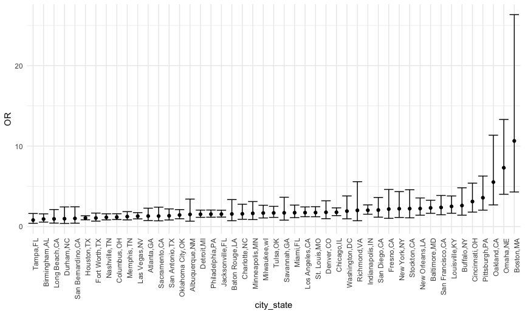

Homework 6 solutions
================
Rio Yan
2020-12-08

## Problem 1

Read in the data.

``` r
homicide_df = 
  read_csv("./data/homicide-data.csv", na = c("", "NA", "Unknown")) %>% 
  mutate(
    city_state = str_c(city, state, sep = ","),
    victim_age = as.numeric(victim_age),
    resolution = case_when(
      disposition == "Closed without arrest" ~ 0,
      disposition == "Open/No arrest" ~ 0,
      disposition == "Closed by arrest" ~ 1)
  ) %>% 
  filter(
    victim_race %in% c("White", "Black"),
    city_state != "Tulsa,AL") %>% 
  select(city_state, resolution, victim_age, victim_race, victim_sex)
```

    ## Parsed with column specification:
    ## cols(
    ##   uid = col_character(),
    ##   reported_date = col_double(),
    ##   victim_last = col_character(),
    ##   victim_first = col_character(),
    ##   victim_race = col_character(),
    ##   victim_age = col_double(),
    ##   victim_sex = col_character(),
    ##   city = col_character(),
    ##   state = col_character(),
    ##   lat = col_double(),
    ##   lon = col_double(),
    ##   disposition = col_character()
    ## )

Start with one city.

| term              |    OR | CI\_lower | CI\_upper |
| :---------------- | ----: | --------: | --------: |
| (Intercept)       | 1.363 |     0.975 |     1.907 |
| victim\_age       | 0.993 |     0.987 |     1.000 |
| victim\_raceWhite | 2.320 |     1.648 |     3.268 |
| victim\_sexMale   | 0.426 |     0.325 |     0.558 |

Try this across cities.

``` r
models_results_df =
  homicide_df %>% 
  nest(data = -city_state) %>% 
  mutate(
    models = 
      map(.x = data, ~glm(resolution ~ victim_age + victim_race + victim_sex,
    data = .x, family = binomial())),
    results = map(models, broom::tidy)
  ) %>% 
  select(city_state, results) %>% 
  unnest(results) %>% 
  mutate(
    OR = exp(estimate),
    CI_lower = exp(estimate - 1.96 * std.error),
    CI_upper = exp(estimate + 1.96 * std.error)
  ) %>% 
  select(city_state, term, OR, starts_with("CI"))
```

``` r
models_results_df %>% 
  filter(term == "victim_raceWhite") %>% 
  mutate(city_state = fct_reorder(city_state, OR)) %>% 
  ggplot(aes(x = city_state, y = OR)) + 
  geom_point() + 
  geom_errorbar(aes(ymin = CI_lower, ymax = CI_upper)) + 
  theme(axis.text.x = element_text(angle = 90, hjust = 1))
```



**Comment**: We can see that Tampa, FL has the lowest OR with small 95%
CI range and Boston,MA has the highest and has the largest 95% CI range.
All the OR are above 0, meaning that comparing to black population, when
victim is white, the cases have a higher chance of being solved.

## Problem 2

Find some residuals

``` r
baby_df = 
  read_csv("./data/birthweight.csv") %>% 
  mutate(
    babysex = factor(babysex), #convert numeric to factor
    frace = factor(frace), #convert numeric to factor
    malform = factor(malform), #convert numeric to factor
    mrace = factor(mrace) #convert numeric to factor
  ) 
```

    ## Parsed with column specification:
    ## cols(
    ##   .default = col_double()
    ## )

    ## See spec(...) for full column specifications.

``` r
baby_df %>% 
  anyNA()
```

    ## [1] FALSE

``` r
#check if there is NA: no NAs
```

``` r
model.matrix(~0+., data=baby_df) %>% 
  cor(use = "pairwise.complete.obs") %>% 
  ggcorrplot(show.diag = F, type="lower", 
             lab=TRUE, lab_size=2, 
             title = "Correlation of parameters of interest")
```

    ## Warning in cor(., use = "pairwise.complete.obs"): the standard deviation is zero


Using correlation matrix to identify which parameters have higher
positive association with birth weight. Decide to pick delwt(mother’s
weight at delivery (pounds)) and gaweeks(gestational age in weeks).

fit a model

``` r
model_fit = lm(bwt ~ delwt + gaweeks, data = baby_df)

#See quality of the model 
model_fit %>%
  broom::glance()
```

    ## # A tibble: 1 x 12
    ##   r.squared adj.r.squared sigma statistic   p.value    df  logLik    AIC    BIC
    ##       <dbl>         <dbl> <dbl>     <dbl>     <dbl> <dbl>   <dbl>  <dbl>  <dbl>
    ## 1     0.227         0.226  450.      636. 4.67e-243     2 -32690. 65389. 65414.
    ## # … with 3 more variables: deviance <dbl>, df.residual <int>, nobs <int>

``` r
#Both are significant coeff
model_fit %>%
  broom::tidy()
```

    ## # A tibble: 3 x 5
    ##   term        estimate std.error statistic   p.value
    ##   <chr>          <dbl>     <dbl>     <dbl>     <dbl>
    ## 1 (Intercept)  -140.      92.4       -1.51 1.30e-  1
    ## 2 delwt           5.54     0.310     17.9  5.95e- 69
    ## 3 gaweeks        62.1      2.18      28.4  4.69e-163

plot residual

``` r
baby_df %>%
  modelr::add_residuals(model_fit) %>%
  ggplot(aes(x = resid)) + geom_density()
```


``` r
baby_df %>% 
  modelr::add_residuals(model_fit) %>% 
  modelr::add_predictions(model_fit) %>% 
  ggplot(aes(x = pred, y = resid)) + geom_point() +
  labs(
    title = "Residuals against fitted value",
    x = "Fitted value",
    y = "Residuals"
  )
```


Overall, residuals are centered around 0.

compare models

``` r
model_fit = lm(bwt ~ delwt + gaweeks, data = baby_df)
model_1 = lm(bwt ~ blength + gaweeks, data = baby_df)
model_2 = lm(bwt ~ bhead * blength * babysex, data = baby_df)
```

``` r
cv_df =
  crossv_mc(baby_df, 100) %>% 
  mutate(
    train = map(train, as_tibble),
    test = map(test, as_tibble)
  )

cv_df = 
  cv_df %>% 
  mutate(
    model_fit = map(train, ~lm(bwt ~ delwt + gaweeks, data = .x)),
    model_1 = map(train, ~lm(bwt ~blength + gaweeks, data = .x)),
    model_2 = map(train, ~lm(bwt ~ bhead * blength * babysex, data = .x))
  ) %>% 
  mutate(
    rmse_fit = map2_dbl(model_fit, test, ~rmse(model = .x, data = .y)),
    rmse_1 = map2_dbl(model_1, test, ~rmse(model = .x, data = .y)),
    rmse_2 = map2_dbl(model_2, test, ~rmse(model = .x, data = .y))
  )
```

plot prediction error for each models

``` r
cv_df %>% 
  select(starts_with("rmse")) %>% 
  pivot_longer(
    everything(),
    names_to = "model",
    values_to = "rmse",
    names_prefix = "rmse_") %>% 
  mutate(model = fct_inorder(model)) %>% 
  ggplot(aes(x = model, y = rmse)) + geom_violin()
```


``` r
##change name
```

From the graph we can see that model 2 using head circumference, length,
sex, and all interactions has the lower rmse, meaning a better model,
while the model I created has the highest rmse. This may be because
adding too many variable increases the degrees of value and increases
it’s predictive accuracy.

## Problem 3

import data

``` r
weather_df = 
  rnoaa::meteo_pull_monitors(
    c("USW00094728"),
    var = c("PRCP", "TMIN", "TMAX"), 
    date_min = "2017-01-01",
    date_max = "2017-12-31") %>%
  mutate(
    name = recode(id, USW00094728 = "CentralPark_NY"),
    tmin = tmin / 10,
    tmax = tmax / 10) %>%
  select(tmax, tmin)
```

    ## Registered S3 method overwritten by 'hoardr':
    ##   method           from
    ##   print.cache_info httr

    ## using cached file: /Users/rio/Library/Caches/R/noaa_ghcnd/USW00094728.dly

    ## date created (size, mb): 2020-10-03 17:39:49 (7.522)

    ## file min/max dates: 1869-01-01 / 2020-10-31

Bootstrapping

For 

``` r
r_sq = 
  weather_df %>% 
  modelr::bootstrap(n = 5000) %>% 
  mutate(
    models = map(strap, ~lm(tmax ~ tmin, data = .x)),
    results = map(models, broom::glance)
  ) %>% 
  select(-strap, -models) %>% 
  unnest(results) 

#distribution
r_sq %>% 
  ggplot(aes(x = r.squared)) + geom_density() +
  labs(
    title = "Distribution of R Squared Values"
  )
```


``` r
#95% CI
r2_ci_lower = quantile(pull(r_sq, r.squared), 0.025)
r2_ci_upper = quantile(pull(r_sq, r.squared), 0.975)
```

For ")

``` r
betas = 
  weather_df %>% 
  modelr::bootstrap(n = 5000) %>% 
  mutate(
    models = map(strap, ~lm(tmax ~ tmin, data = .x)),
    results = map(models, broom::tidy)
  ) %>% 
  select(-strap, -models) %>% 
  unnest(results) %>%
  mutate(
    term = str_replace(term,"\\(Intercept\\)","beta0"),
    term = str_replace(term,"tmin","beta1")
  ) %>% 
  spread(term, estimate) %>%
  group_by(.id) %>%
  summarise_all(na.omit) %>% 
  mutate(
    beta_c = log(beta0 * beta1)
  ) 


  toDelete = seq(1, nrow(betas), 2)
betas = betas[ toDelete ,]
  
  
#distribution
betas %>% 
  ggplot(aes(x = beta_c)) + geom_density() +
  labs(
    title = "Distribution of Log Estimates"
  )
```


``` r
#95% CI
beta_ci_lower = quantile(pull(betas,beta_c), 0.025)
beta_ci_upper = quantile(pull(betas,beta_c), 0.975)
```

The distributions of
 and ") using bootstrap seem to be
following a normal distribution with rsquare’s distribution centered
around 0.915 and beta centered around 2.02. Both are slightly left
skewed.
 95%CI is (0.8936977, 0.9274807) and ") 95%CI is (1.9656328,
2.0584694).
