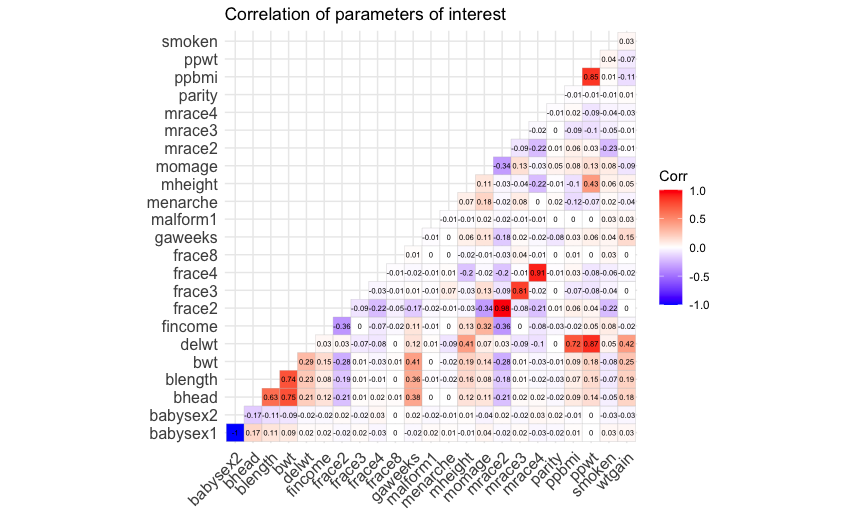

Homework 6 solutions
================
Rio Yan
2020-12-07

## Problem 1

Read in the data.

``` r
homicide_df = 
  read_csv("./data/homicide-data.csv", na = c("", "NA", "Unknown")) %>% 
  mutate(
    city_state = str_c(city, state, sep = ","),
    victim_age = as.numeric(victim_age),
    resolution = case_when(
      disposition == "Closed without arrest" ~ 0,
      disposition == "Open/No arrest" ~ 0,
      disposition == "Closed by arrest" ~ 1)
  ) %>% 
  filter(
    victim_race %in% c("White", "Black"),
    city_state != "Tulsa,AL") %>% 
  select(city_state, resolution, victim_age, victim_race, victim_sex)
```

    ## Parsed with column specification:
    ## cols(
    ##   uid = col_character(),
    ##   reported_date = col_double(),
    ##   victim_last = col_character(),
    ##   victim_first = col_character(),
    ##   victim_race = col_character(),
    ##   victim_age = col_double(),
    ##   victim_sex = col_character(),
    ##   city = col_character(),
    ##   state = col_character(),
    ##   lat = col_double(),
    ##   lon = col_double(),
    ##   disposition = col_character()
    ## )

Start with one city.

| term              |    OR | CI\_lower | CI\_upper |
| :---------------- | ----: | --------: | --------: |
| (Intercept)       | 1.363 |     0.975 |     1.907 |
| victim\_age       | 0.993 |     0.987 |     1.000 |
| victim\_raceWhite | 2.320 |     1.648 |     3.268 |
| victim\_sexMale   | 0.426 |     0.325 |     0.558 |

Try this across cities.

``` r
models_results_df =
  homicide_df %>% 
  nest(data = -city_state) %>% 
  mutate(
    models = 
      map(.x = data, ~glm(resolution ~ victim_age + victim_race + victim_sex,
    data = .x, family = binomial())),
    results = map(models, broom::tidy)
  ) %>% 
  select(city_state, results) %>% 
  unnest(results) %>% 
  mutate(
    OR = exp(estimate),
    CI_lower = exp(estimate - 1.96 * std.error),
    CI_upper = exp(estimate + 1.96 * std.error)
  ) %>% 
  select(city_state, term, OR, starts_with("CI"))
```

``` r
models_results_df %>% 
  filter(term == "victim_sexMale") %>% 
  mutate(city_state = fct_reorder(city_state, OR)) %>% 
  ggplot(aes(x = city_state, y = OR)) + 
  geom_point() + 
  geom_errorbar(aes(ymin = CI_lower, ymax = CI_upper)) + 
  theme(axis.text.x = element_text(angle = 90, hjust = 1))
```


**Comment**:

## Problem 2

Find some residuals

``` r
baby_df = 
  read_csv("./data/birthweight.csv", na = c("", "NA", "Unknown")) %>% 
  mutate(
    babysex = factor(babysex),
    frace = factor(frace),
    malform = factor(malform),
    mrace = factor(mrace)
  )
```

    ## Parsed with column specification:
    ## cols(
    ##   .default = col_double()
    ## )

    ## See spec(...) for full column specifications.

``` r
model.matrix(~0+., data=baby_df) %>% 
  cor(use = "pairwise.complete.obs") %>% 
  ggcorrplot(show.diag = F, type="lower", 
             lab=TRUE, lab_size=2, 
             title = "Correlation of parameters of interest")
```

    ## Warning in cor(., use = "pairwise.complete.obs"): the standard deviation is zero



fit a model

``` r
model_fit = lm(bwt ~ blength + delwt + gaweeks, data = baby_df)

model_fit %>% 
  broom::glance()
```

    ## # A tibble: 1 x 12
    ##   r.squared adj.r.squared sigma statistic p.value    df  logLik    AIC    BIC
    ##       <dbl>         <dbl> <dbl>     <dbl>   <dbl> <dbl>   <dbl>  <dbl>  <dbl>
    ## 1     0.590         0.590  328.     2079.       0     3 -31314. 62638. 62670.
    ## # … with 3 more variables: deviance <dbl>, df.residual <int>, nobs <int>

``` r
model_fit %>% 
  broom::tidy()
```

    ## # A tibble: 4 x 5
    ##   term        estimate std.error statistic  p.value
    ##   <chr>          <dbl>     <dbl>     <dbl>    <dbl>
    ## 1 (Intercept) -4472.      97.1       -46.1 0.      
    ## 2 blength       124.       2.00       62.0 0.      
    ## 3 delwt           2.70     0.231      11.7 4.14e-31
    ## 4 gaweeks        26.1      1.69       15.4 2.43e-52

``` r
#residual of birth length
baby_df %>% 
  modelr::add_residuals(model_fit) %>% 
  ggplot(aes(x = blength, y = resid)) + 
  geom_point()
```


``` r
#residual of mother's weight at delivery
baby_df %>% 
  modelr::add_residuals(model_fit) %>% 
  ggplot(aes(x = delwt, y = resid)) + 
  geom_point()
```


``` r
#residual of gestational age
baby_df %>% 
  modelr::add_residuals(model_fit) %>% 
  ggplot(aes(x = gaweeks, y = resid)) + 
  geom_point()
```


compare models

``` r
model_fit = lm(bwt ~ blength + delwt + gaweeks, data = baby_df)
model_1 = lm(bwt ~ blength + gaweeks, data = baby_df)
model_2 = lm(bwt ~ bhead * blength * babysex, data = baby_df)
```

``` r
cv_df =
  crossv_mc(baby_df, 100) %>% 
  mutate(
    train = map(train, as_tibble),
    test = map(test, as_tibble)
  )
```
